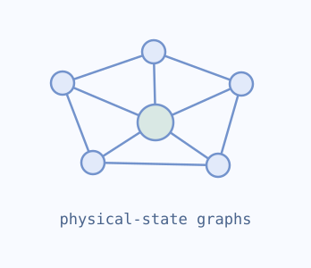
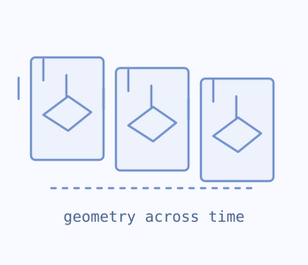
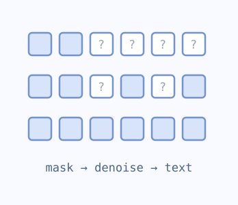
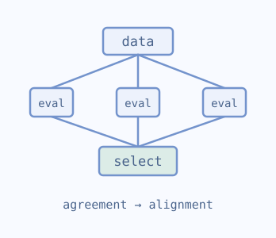
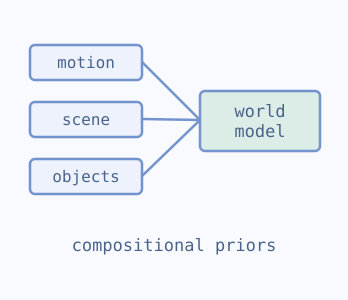
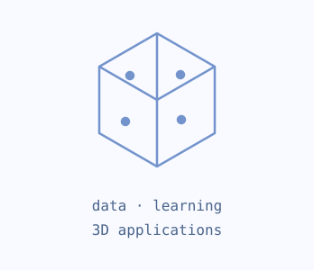

# Runhao Li

I am a master's student in Computer Science (AI) at the **University of Southern California**, graduating in **May 2027**.

I build and evaluate LLMs and agents. My interests include **reliable agent systems**, **model alignment**, **diffusion language models**, and **physical reasoning**.

Previously, I worked on machine learning at **TikTok**, **General Motors**, and **Shanghai AI Laboratory**, with research experience at **Princeton** and **UC Berkeley**.

[email](mailto:runhaoli@usc.edu) &nbsp;/&nbsp; [scholar](https://scholar.google.com/citations?user=HkEIcZ0AAAAJ&hl=en) &nbsp;/&nbsp; [linkedin](https://www.linkedin.com/in/runhao-li-lee021004) &nbsp;/&nbsp; [openreview](https://openreview.net/profile?id=~Runhao_Li3) &nbsp;/&nbsp; [website](https://runhaoli-creator.github.io/)

Seeking **2027 opportunities in Software Engineering (AI/ML) and Machine Learning Engineering**.

[research](#research) · [experience](#experience) · [open-source projects](#open-source-projects)

## research

I am interested in how models learn, reason, and act reliably — from better training signals to agents that understand the world around them.

<table>
<tr>
<td width="155" align="center" valign="middle"></td>
<td valign="top">

<strong><a href="https://openreview.net/forum?id=vxrLfNSsBQ">PhysGraphNet: Physical-State Scene Graphs via Latent Graph Reasoning and Counterfactual Supervision</a></strong> 
<strong>Runhao Li</strong>, Zhengtao Yao, Yan Wen, Guang Yang, Siheng Wang, Chenhao Wei, Rongchao Zhang, Guoqing Ma, Haoyan Xu, Junhao Dong 
<em><em>NeurIPS</em>, 2026 · Poster</em>

<a href="https://openreview.net/forum?id=vxrLfNSsBQ">openreview</a> &nbsp;/&nbsp; <a href="https://openreview.net/pdf?id=vxrLfNSsBQ">pdf</a>

Predicts physical-state scene graphs from an image and a goal, combining latent graph reasoning with counterfactual supervision to support physical reasoning.

</td>
</tr>
<tr>
<td width="155" align="center" valign="middle"></td>
<td valign="top">

<strong><a href="https://arxiv.org/abs/2601.23286">VideoGPA: Distilling Geometry Priors for 3D-Consistent Video Generation</a></strong> 
Hongyang Du, Junjie Ye, Xiaoyan Cong, <strong>Runhao Li</strong>, et al. 
<em><em>ICML</em>, 2026</em>

<a href="https://arxiv.org/abs/2601.23286">paper</a> &nbsp;/&nbsp; <a href="https://openreview.net/forum?id=neygndmdoS">openreview</a>

Uses geometry-derived preference signals to improve the 3D consistency of video diffusion models without human preference annotations.

</td>
</tr>
<tr>
<td width="155" align="center" valign="middle"></td>
<td valign="top">

<strong><a href="https://arxiv.org/abs/2607.25157">PreDiff-LM: Pretrained Discrete Masked Diffusion Language Modeling with Hybrid Attention</a></strong> 
<strong>Runhao Li</strong>, Zhengtao Yao, Xupeng Chen, et al. 
<em>Preprint, 2026</em>

<a href="https://arxiv.org/abs/2607.25157">paper</a> &nbsp;/&nbsp; <a href="https://openreview.net/forum?id=zl9y14yJuN">openreview</a> &nbsp;/&nbsp; <a href="https://github.com/runhaoli-creator/PreDiff-LM-code">code</a>

Studies hybrid attention as a way to adapt causal language models to bidirectional denoising, with controlled comparisons of generation quality and training efficiency.

</td>
</tr>
<tr>
<td width="155" align="center" valign="middle"></td>
<td valign="top">

<strong><a href="https://arxiv.org/abs/2607.25136">Less Data, Better Alignment: Data-Centric Multi-Evaluator Agreement for Preference Optimization</a></strong> 
Zhengtao Yao, <strong>Runhao Li</strong>, Xupeng Chen, et al. 
<em>Preprint, 2026</em>

<a href="https://arxiv.org/abs/2607.25136">paper</a> &nbsp;/&nbsp; <a href="https://github.com/runhaoli-creator/dmapo">code</a>

DMAPO selects 1,871 training examples from 54,236 candidates using multi-evaluator agreement and critique, examining data quality in preference optimization.

</td>
</tr>
<tr>
<td width="155" align="center" valign="middle"></td>
<td valign="top">

<strong><a href="https://arxiv.org/abs/2606.02577">RoboDream: Compositional World Models for Scalable Robot Data Synthesis</a></strong> 
Junjie Ye, Rong Xue, Basile Van Hoorick, <strong>Runhao Li</strong>, et al. 
<em>Preprint, 2026</em>

<a href="https://arxiv.org/abs/2606.02577">paper</a> &nbsp;/&nbsp; <a href="https://junjieye.com/RoboDream/">project</a>

Composes robot motion, scene priors, and object priors to synthesize demonstrations in new environments and support data-efficient robot learning.

</td>
</tr>
<tr>
<td width="155" align="center" valign="middle"></td>
<td valign="top">

<strong><a href="https://arxiv.org/abs/2606.04291">A Cookbook of 3D Vision: Data, Learning Paradigms, and Application</a></strong> 
Hongyang Du, Zongxia Li, Dawei Liu, <strong>Runhao Li</strong>, et al. 
<em><em>CVPR OpenSUN3D Workshop</em>, 2026</em>

<a href="https://arxiv.org/abs/2606.04291">paper</a> &nbsp;/&nbsp; <a href="https://openreview.net/forum?id=5wHE69kDC5">openreview</a>

A data-centric map of 3D representations, datasets, learning paradigms, and applications spanning reconstruction, generation, and world modeling.

</td>
</tr>
</table>

[More on Google Scholar](https://scholar.google.com/citations?user=HkEIcZ0AAAAJ&hl=en)

## experience

| When | Where & work |
| :--- | :--- |
| Jun–Sep 2026 | **TikTok · ML Engineer Intern** Post-training, multimodal moderation, and agent tooling for case replay and hard-example collection. |
| May–Sep 2026 | **Princeton University · Research Assistant** Causal evaluation and credit assignment for preventive actions in LLM agents. |
| Jan–Apr 2026 | **General Motors · ML Engineer Intern** Hybrid attention and confidence-aware decoding for pretrained diffusion language models. |
| Sep–Dec 2025 | **UC Berkeley · Research Assistant** Data-centric alignment through multi-evaluator agreement and preference optimization. |
| Jun–Sep 2025 | **Shanghai AI Laboratory · ML Engineer Intern** Agent orchestration, retrieval, and efficient vision-language model serving. |

## open-source projects

- **[DMAPO](https://github.com/runhaoli-creator/dmapo)** — Multi-evaluator agreement, confidence filtering, and preference optimization.
- **[PreDiff-LM](https://github.com/runhaoli-creator/PreDiff-LM-code)** — Pretrained masked diffusion language modeling with hybrid attention.
- **[ACM-ICL](https://github.com/runhaoli-creator/acm-icl)** — Calibrated multi-agent reasoning and vLLM multi-LoRA serving.
- **[latent-agent-team](https://github.com/runhaoli-creator/latent-agent-team)** — Learned latent channels for budgeted communication between agents.
- **[paper_read](https://github.com/runhaoli-creator/paper_read)** — Research workflows and citation-verification tools.

More projects

- [RAMTL](https://github.com/runhaoli-creator/RAMTL) — Shared-backbone, multi-role tool use.
- [updr-reasoning](https://github.com/runhaoli-creator/updr-reasoning) — Uncertainty-guided debate and self-repair.
- [DEAMS](https://github.com/runhaoli-creator/DEAMS) — Alignment across heterogeneous vision-language agents.
- [PAGC](https://github.com/runhaoli-creator/PAGC) — Grounded communication in cooperative multi-agent learning.
- [KTM-WM](https://github.com/runhaoli-creator/KTM-WM) — Kernel-based world models for agent planning.

Toolkit

| Area | Technologies |
| :--- | :--- |
| Software & services | Python · C++ · SQL · FastAPI · Docker · Kubernetes · AWS · Redis |
| Training & alignment | PyTorch · Transformers · TRL · PEFT · LoRA/QLoRA · DeepSpeed · FSDP |
| Agents, retrieval & inference | LangGraph · vLLM · FAISS · BM25 · Reranking |
| Evaluation & delivery | MLflow · Weights & Biases · GitHub Actions |

---

[runhaoli@usc.edu](mailto:runhaoli@usc.edu) · [Personal website](https://runhaoli-creator.github.io/)
